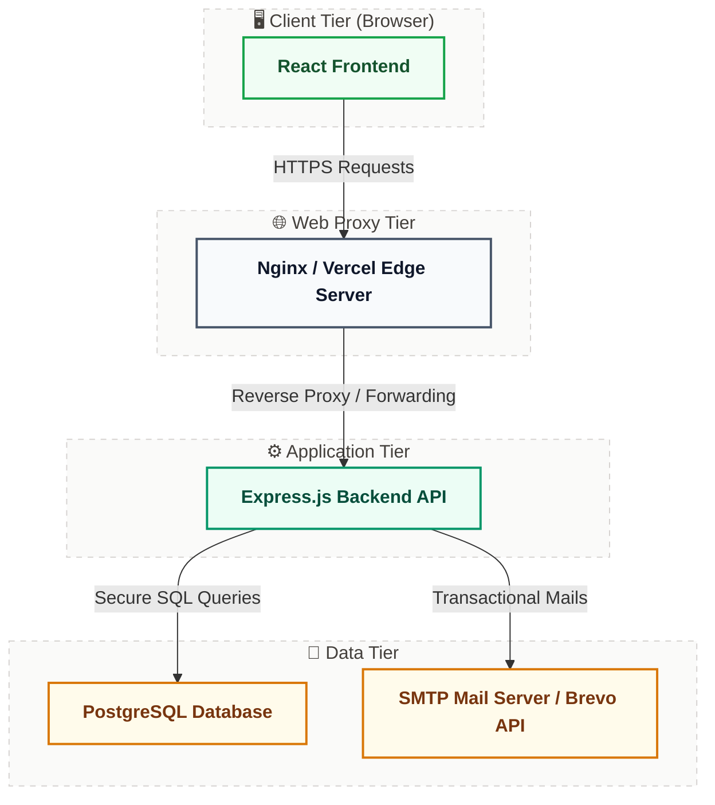
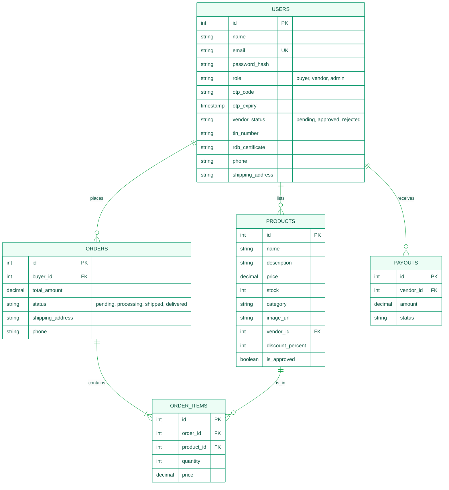
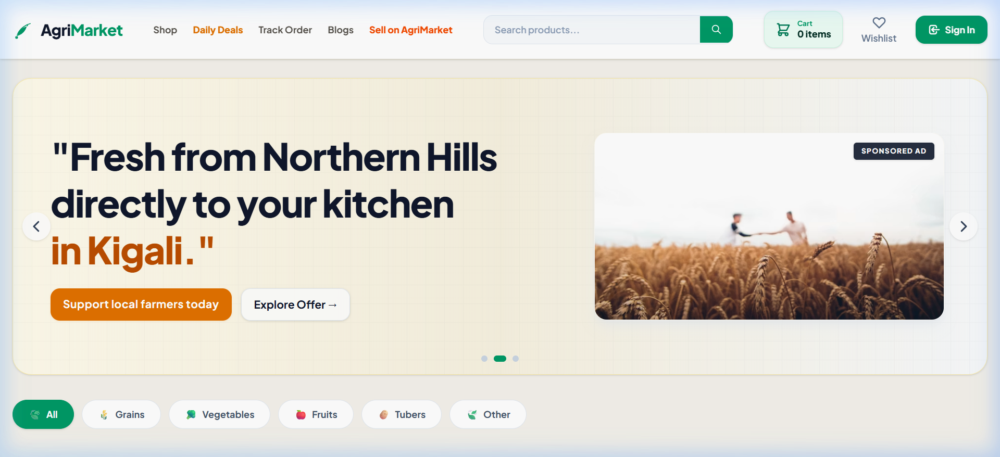
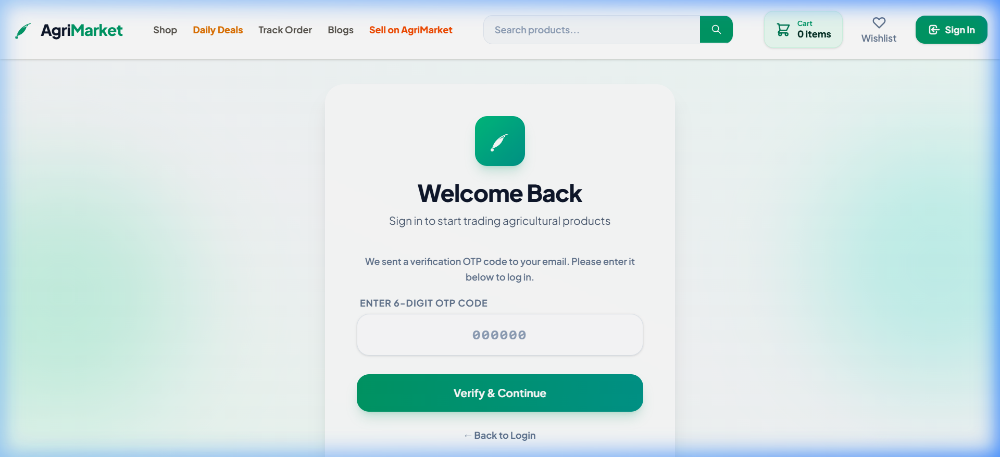
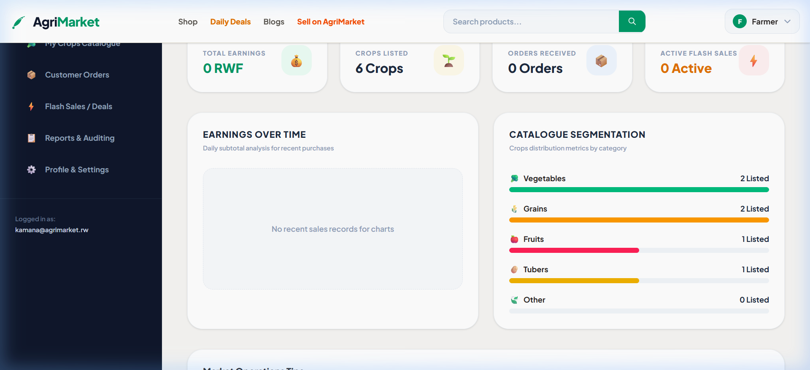
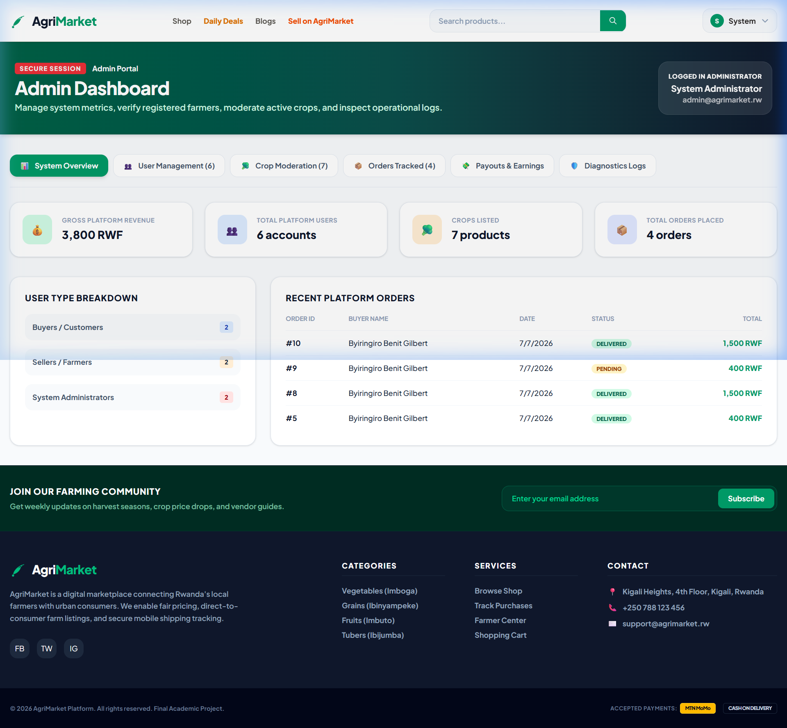
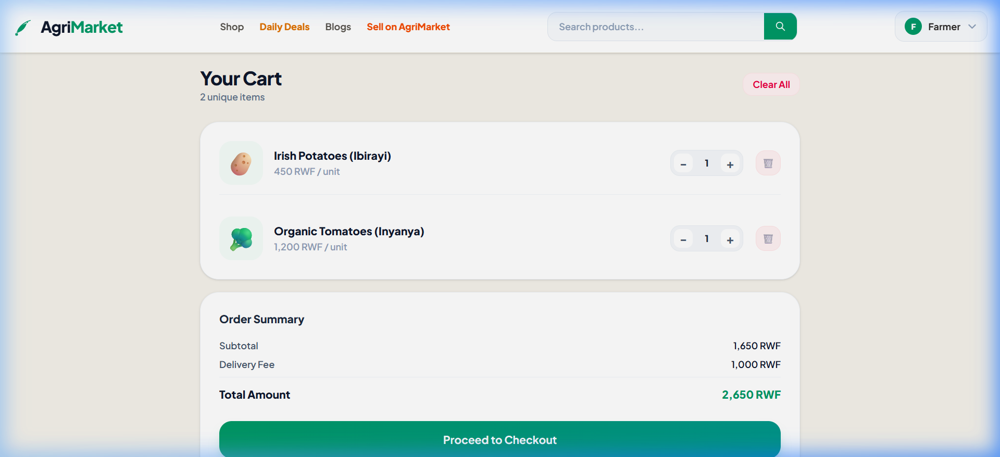
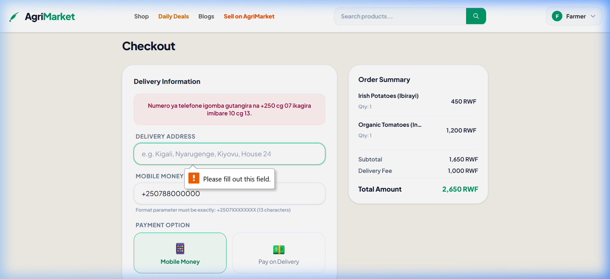
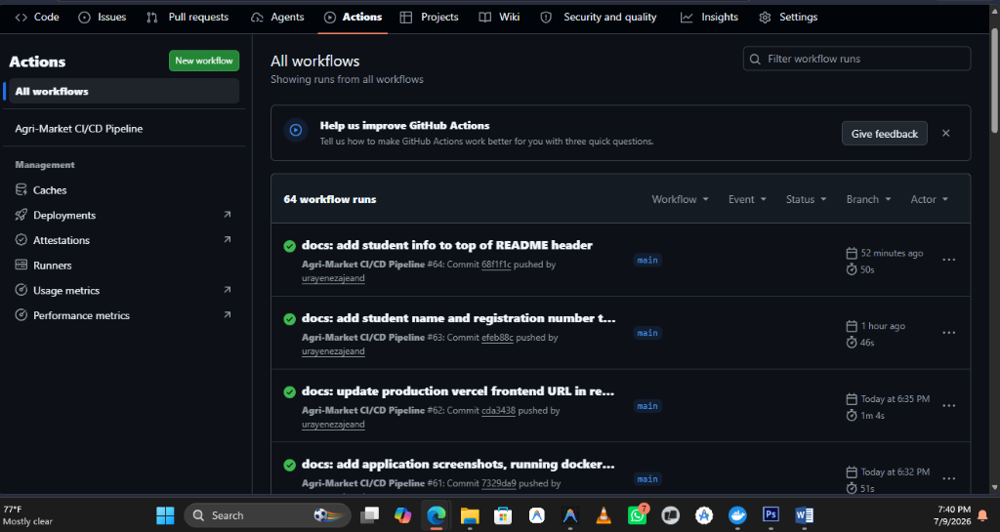
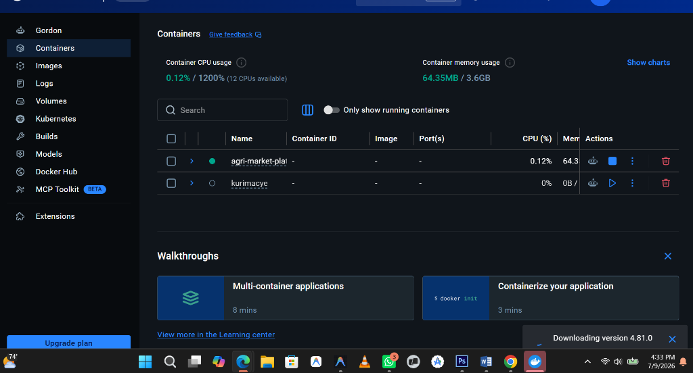

# 🌾 Project Report: AgriMarket Web Application
**Course:** EWA408510 – E-Commerce and Web Application  
**Assessment:** Final Examination (Project-Based)  
**Academic Year:** 2025-2026  
**Instructor:** Eric Maniraguha  
**Institution:** University of Lay Adventists of Kigali (UNILAK)  

---

## 1. Introduction
Agriculture is the backbone of Rwanda's economy, employing a majority of the population and contributing significantly to the national GDP. However, smallholder farmers often struggle with direct access to urban consumer markets, leaving them dependent on middle agents who depress farm-gate prices. 

**AgriMarket** is a modern, responsive, and secure multi-vendor agricultural e-commerce platform designed specifically for the Rwandan market context. It bridges the gap between rural farmers (vendors) and urban consumers (buyers), allowing farmers to list fresh crop yields directly and enabling buyers to browse, cart, and purchase fresh produce with simulated mobile money (MTN/Airtel MoMo) checkout integrations.

---

## 2. Problem Statement
The agricultural value chain in Rwanda suffers from several distinct bottlenecks:
1. **Market Fragmentation:** Rural farmers lack direct channels to advertise their yields (e.g., Irish Potatoes from Musanze or Sweet Bananas from Southern Province) to retail customers in Kigali.
2. **Asymmetric Information:** Lack of transparent pricing leads to exploitation by intermediaries.
3. **Manual Transaction Tracking:** Farmers lack structured records of sales, stocks, and earnings, making it difficult to scale their businesses.
4. **Security Vulnerabilities:** Existing simple marketplace listings are prone to fraud, lack authenticated buyer-seller agreements, and do not verify business credentials (like TIN or RDB corporate certificates).

---

## 3. Project Objectives
The main objectives of this project are:
- **Direct Trade Link:** Establish a direct-to-consumer digital marketplace connecting farmers and urban buyers.
- **Role-Based Control:** Separate capabilities cleanly between Buyers (order crops), Vendors (manage listings & track sales), and Administrators (onboard sellers and moderate products).
- **Secure Transactional Ordering:** Use database-level transaction protocols (`BEGIN`/`COMMIT`/`ROLLBACK`) to prevent stock-count discrepancies during concurrent checkouts.
- **Enhanced Account Security:** Implement multi-factor security via One-Time Passwords (OTP) delivered via email for both logins and password resets.
- **Production-Ready Operations:** Containerize the entire stack using Docker and verify integrity using automated CI/CD workflows.

---

## 4. System Features
AgriMarket is packed with features tailored to Rwandan cooperatives:
- **Responsive UI/UX:** A forest green themed design matching agricultural branding, optimized for desktop and mobile displays.
- **Product Search & Filtering:** Filter crops by categories (Vegetables, Grains, Fruits, Tubers) and perform instantaneous search indexing.
- **Shopping Cart System:** Persistent add-to-cart operations, quantity modifiers, and auto-calculating totals.
- **Secure Checkout:** Customer details collection with strict Rwandan phone number validations (matching `+2507...` formats).
- **Vendor Control Center:** Private dashboard showcasing visual sales charts, inventory metrics, order status tracking, and business profile management.
- **Admin Moderation Portal:** Moderation of listed crop products, validation of seller TIN/RDB documentation, and payout tracking.
- **2FA OTP Auth System:** Secure register/login checks sending automated OTP verification codes, falling back to mock logging if offline.

---

## 5. Technologies Used
The stack uses modern, lightweight, and scalable web technologies:

* **Frontend:**
  - **React 19 & TypeScript:** Component-driven framework ensuring type-safe development.
  - **Vite:** High-performance local development build tool.
  - **Tailwind CSS:** Utility-first styling framework for agricultural branding.
  - **React Router:** Handles client-side navigation.

* **Backend API Server:**
  - **Node.js & Express:** Lightweight, event-driven JavaScript server framework.
  - **JSON Web Tokens (JWT):** Stateless security verification wristbands for authorized sessions.
  - **Bcrypt.js:** Industry-standard secure salt hashing for passwords.
  - **Nodemailer & Brevo HTTP API:** Automated emails for transactional invoices and OTP challenges.

* **Database & Infrastructure:**
  - **PostgreSQL:** Relational database management system for secure structured data.
  - **Docker & Docker Compose:** Standard containerization of Database, Backend, and Frontend.
  - **GitHub Actions:** CI/CD pipeline verifying builds and container integrity on pushes.

---

## 6. System Architecture
AgriMarket follows a standard client-server architecture model:

1. The client browser renders the React frontend (hosted on **Vercel**).
2. API requests are routed securely to the Node.js Express server (hosted on **Render**).
3. The Express server executes relational schema queries on the PostgreSQL Database.
4. Emails are triggered asynchronously via SMTP / Brevo API during OTP login/checkout events.

---

## 7. Database Design
The system uses a highly structured relational database schema configured in [server/schema.sql](file:///C:/Users/Benit/Documents/JADO/E-COMMERCE/agri-market-platform/server/schema.sql):

---

## 8. Screenshots of the Application

Here are the key user interface screenshots capturing the end-to-end functionality of the platform:

1. **Homepage:** Visual hero section showcasing fresh Rwandan crops with category filters and instant search bar.
   

2. **OTP Login Challenge Modal:** The secondary 2FA security step prompting the user for the 6-digit verification code sent to their email.
   

3. **Vendor Dashboard:** Business performance overview showing total earnings, active crop inventory levels, sales tables, and profile settings for Farmer Kamana.
   

4. **Admin Dashboard:** Central panel highlighting platform usage statistics, approval buttons for pending sellers/crops, and payout logs.
   

5. **Shopping Cart:** Shopping cart interface displaying added items, quantities, and real-time total updates.
   

6. **Checkout & MoMo Validation:** Order checkout form displaying input fields, MTN/Airtel Mobile Money payment option, and validation alerts.
   

---

## 9. GitHub Repository Link
- **Repository URL:** [https://github.com/urayenezajeand/agri-market-platform](https://github.com/urayenezajeand/agri-market-platform)

---

## 10. Deployment Link
The application is fully hosted online:
- **Frontend (Vercel):** [https://agri-markett.vercel.app/](https://agri-markett.vercel.app/)
- **Backend (Render):** [https://agri-market-api.onrender.com](https://agri-market-api.onrender.com) *(Note: Replace with your actual deployment link if different)*

---

## 11. CI/CD Implementation
Continuous Integration is configured in [.github/workflows/ci-cd.yml](file:///C:/Users/Benit/Documents/JADO/E-COMMERCE/agri-market-platform/.github/workflows/ci-cd.yml) and runs on every push to the `main` or `master` branches:

- **Frontend Step:** Installs dependencies and verifies React compile/bundling (`npm run build`).
- **Backend Step:** Installs dependencies, validates Node.js syntax, and runs connection syntax validations (`node -c index.js`).
- **Docker Step:** Triggers Docker Buildx verification pipelines ensuring that both frontend and backend Dockerfiles compile and assemble without issues.

### CI/CD Workflow Execution Evidence
The automated CI/CD pipeline validates frontend compilation, backend code syntax, and Docker container structure on every push:
 *(Note: Please replace this with a screenshot of your successful GitHub Actions workflow execution)*

---

## 12. Docker Implementation
AgriMarket leverages a multi-container Docker setup for localized testing:

- **Frontend Dockerfile:** Uses a two-stage build. First, compiles React files into static assets. Second, copies those assets to an lightweight `nginx:alpine` proxy server container exposing Port `80`.
- **Backend Dockerfile:** Sets up a `node:20-alpine` workspace, installs production dependencies, copies server source, and exposes Port `5000`.
- **Docker Compose:** Spins up three services (`db`, `backend`, `frontend`) on a shared virtual network, setting up health flags and database environment variables.

### Docker Build & Execution Evidence
The application successfully containerizes and runs the database, backend, and frontend proxy services in a unified container network:

---

## 13. Challenges Encountered
1. **Cloud Database SSL Enforcement:** Render's PostgreSQL instance requires SSL connections. In development, the local database ran without SSL. We resolved this dynamically by checking `process.env.DATABASE_URL` or `NODE_ENV` in [server/db.js](file:///C:/Users/Benit/Documents/JADO/E-COMMERCE/agri-market-platform/server/db.js) and applying `{ ssl: { rejectUnauthorized: false } }` only in production.
2. **Nodemailer Cloud Ports Restrictions:** Cloud servers (such as Render) block standard SMTP port `25` and force DNS lookups over IPv6 which can result in network timeout errors. To bypass this, we forced the Node transporter to use IPv4 resolving by configuring `family: 4` and set up fallback logging blocks.

---

## 14. Future Enhancements
- **SMS Integration:** Integrate MTN MoMo SMS gateways to send transaction warnings directly to feature phones.
- **Real MTN MoMo API Integration:** Switch the checkout simulation to the active MTN MoMo Sandbox API to process real-time push payments in Rwanda.
- **Progressive Web Application (PWA):** Configure service workers to cache products list locally for offline browsing in remote rural areas with poor connectivity.

---

## 15. Conclusion
Developing **AgriMarket** demonstrated the power of linking frontend React frameworks with relational PostgreSQL backends. By implementing advanced concepts like role-based authentication, two-factor email OTPs, database transactions, Docker containerization, and CI/CD pipelines, we created a secure, reliable, and scalable web application. This platform offers a tangible solution to real economic challenges faced by agricultural cooperatives in Rwanda.
